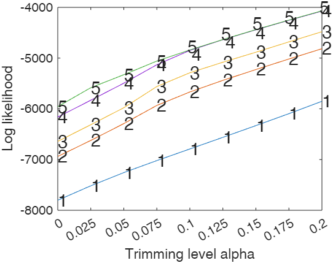

# Choice of trimming proportion and number of clusters in robust clustering based on trimming

<table>
  <tr>
    <td></td>
    <td> <b> <H3>Code to reproduce  the figures of paper "Choice of trimming proportion and number of clusters in robust clustering based on trimming </H3></b> </td>
  </tr>
</table>

Note: in order to run the files below you need to have [FSDA toolbox](https://https://www.mathworks.com/matlabcentral/fileexchange/72999-fsda-flexible-statistics-data-analysis-toolbox) installed

**Abstract**

So-called "classification trimmed likelihood curves" have been proposed as a heuristic tool to determine the number of clusters and trimming proportion in trimmingbased
robust clustering methods. However, these curves needs a careful visual inspection,
and this way of choosing parameters requires subjective decisions. This work is
intended to provide theoretical background for the understanding of these curves and
the elements involved in their derivation. Moreover, a parametric bootstrap approach
is presented in order to automatize the choice of parameter more by providing a reduced
list of "sensible" choices for the parameters. The user can then pick a solution
that fits their aims from that reduced list.

---

In the table below you can find  the original source (MATLAB live script): .mlx file and the corresponding .ipynb file. 

**MATLAB live script files**

The .mlx file 
contain both the code and the output that the code produces.

:eyes: To view the .mlx files click  on the "File Exchange button"

▶️ To run the .mlx files in the free MATLAB on line click on "Run in MATLAB Online". The repo will be automatically cloned. 

The Jupiter notebook version of the files is also given in the last column of the table below. Similarly to the .mlx files the Jupiter notebook files also contain both the code and the output produced by the code.

**Jupiter notebook files**

To view the .ipynb files click on the corresponding link.

To run the .ipynb files inside the agnostic environment jupiter notebook follow the instructions in the file
[ipynbRunInstructions.md](https://github.com/UniprJRC/MonitoringBook/blob/main/ipynbRunInstructions.md). 

| FileName | View :eyes:| Run ▶️ | Jupiter notebook |
| -------- | ---- | --- | ---- |
|`simulatedData.mlx`: generate Figure 1  |  |   | [simulatedData.ipynb](https://github.com/UniprJRC/boot-TCLUST/blob/main/simulatedData.ipynb) |
 `simulatedDataBoot.mlx`: generate Figure 2 and Table 2 |  |   | [simulatedDataBoot.ipynb](https://github.com/UniprJRC/boot-TCLUST/blob/main/simulatedDataBoot.ipynb)
`fig3.mlx`: generate Figure 3 |  |   | [fig3.ipynb](https://github.com/UniprJRC/boot-TCLUST/blob/main/fig3.ipynb)
|`geyserData.mlx`: generate Figure 7  |  |   | [geyserData.ipynb](https://github.com/UniprJRC/boot-TCLUST/blob/main/geyserData.ipynb) |
 `covidData.mlx`: generate Figures 8 and 9 |  |   | [covidData.ipynb](https://github.com/UniprJRC/boot-TCLUST/blob/main/covidData.ipynb) |

Remark: in order to run the files we assume that the free MATLAB Add On FSDA must be installed.

---

We can also share, upon request,  the code which has been used in the simulation study. 

---

